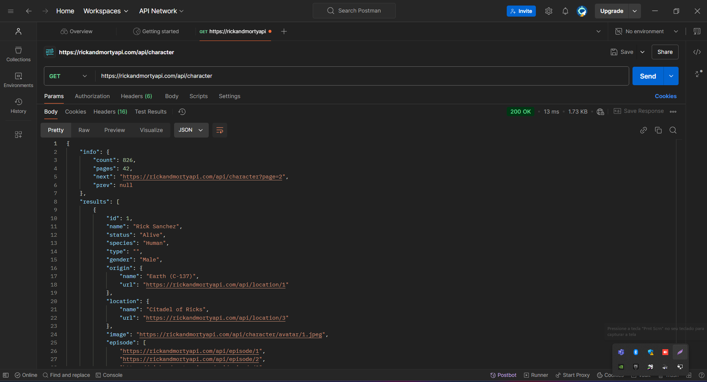
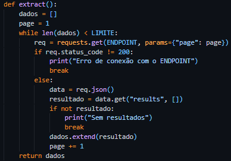
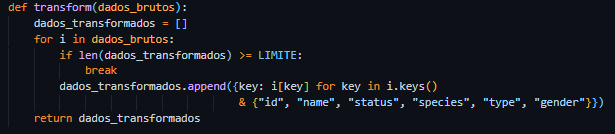
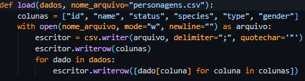

# CaseLeoo
Gabriel Celestino de Souza

# API Rick and Morty 

Este scrpt realiza uma requisição à API pública de Rick and Morty utilizando o paradigma ETL para extrair, transformar e carregar dados dos personagens em um arquivo CSV.

# Teste da API no Postman

## Requisitos

- **Python 3.7** ou superior.
- Bibliotecas utilizadas:
  - requests: Para fazer requisições HTTP e consumir a API.
  - csv: Para gravar os dados extraídos em um arquivo CSV.

## Estrutura do Projeto
    - **Imagem**: Arquivo com prints do script.
    - **config.py**: Arquivo com as configurações utilizadas no código principal.
    - **RickAndMorty.py**: Arquivo principal que contém o código de extração, transformação e carregamento de dados.
##
    #Extract
        - Função para consumir a api, ja verificando se existem uma conexão, e fazendo o controle das páginas até o loop for falso, e armazenando as requisições em um JSON.
        
    #Transform
        - Função que irá tratar os dados, e filtra-los, selecionando somente os dados escolhidos utilizando o dictionary comprehension, tornando o código menor e mais fácil de entender.
        .
        #Load
            - Função que recebe os dados ja tratados, e ira verificar todos eles e adicionar a um arquivo CSV.
            .
## Como Executar

